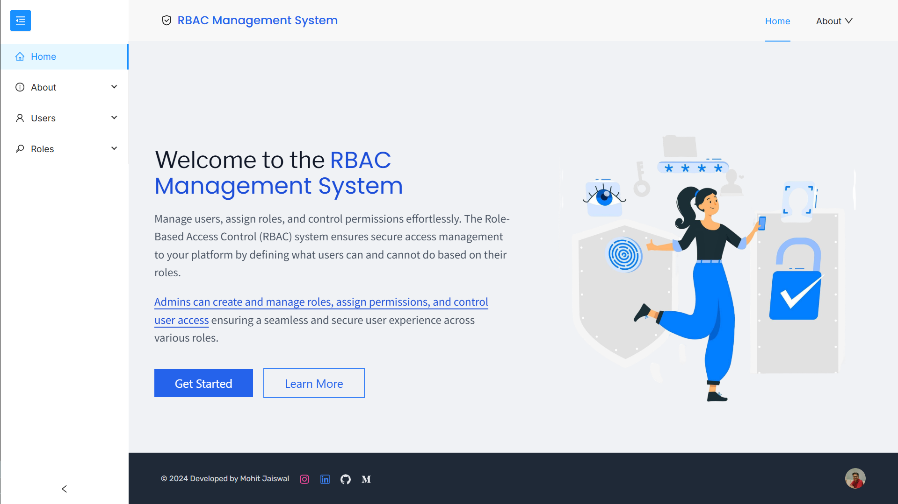
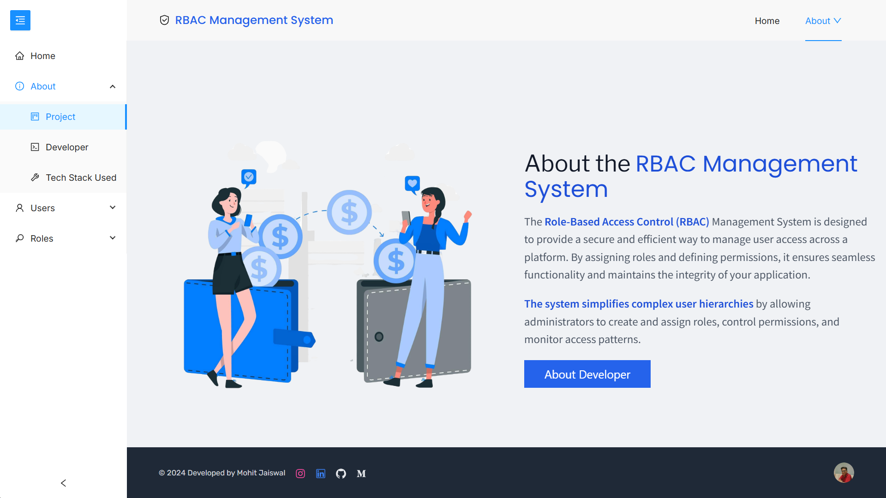
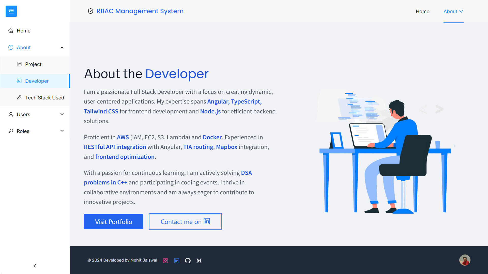
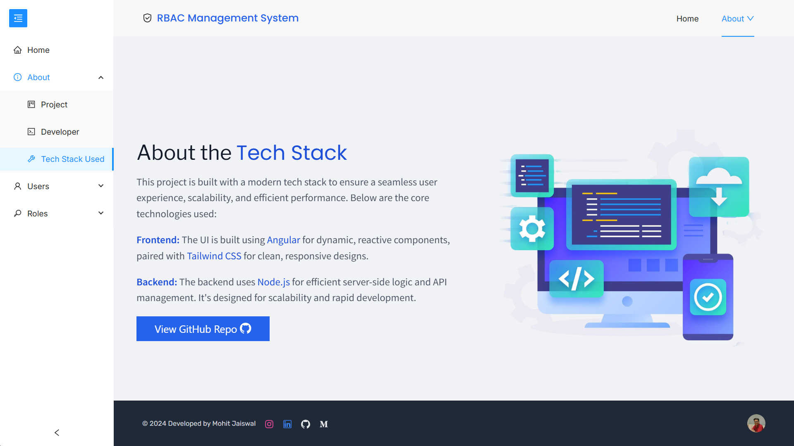
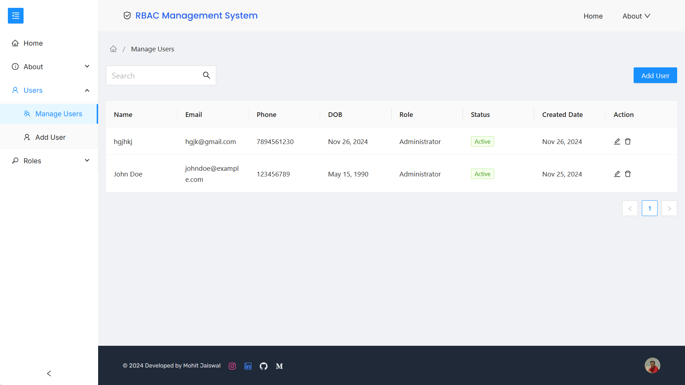
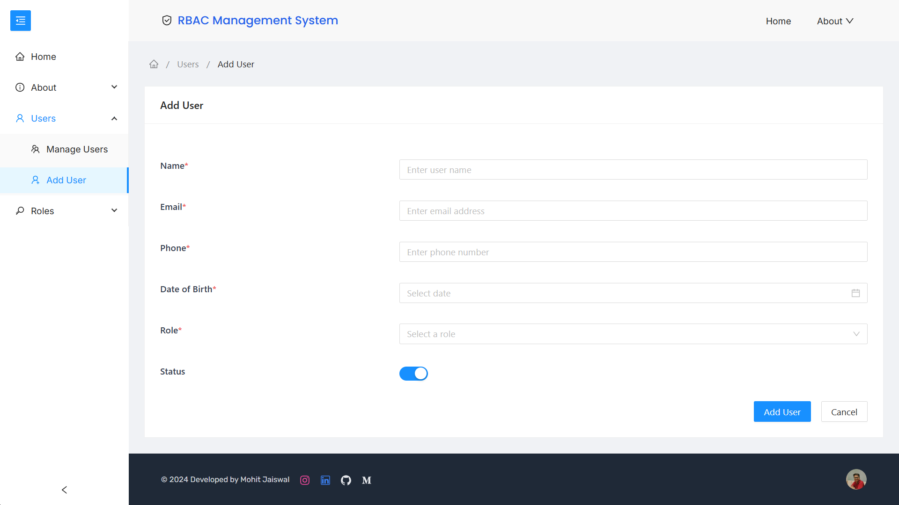
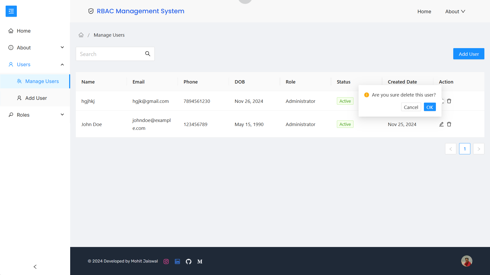
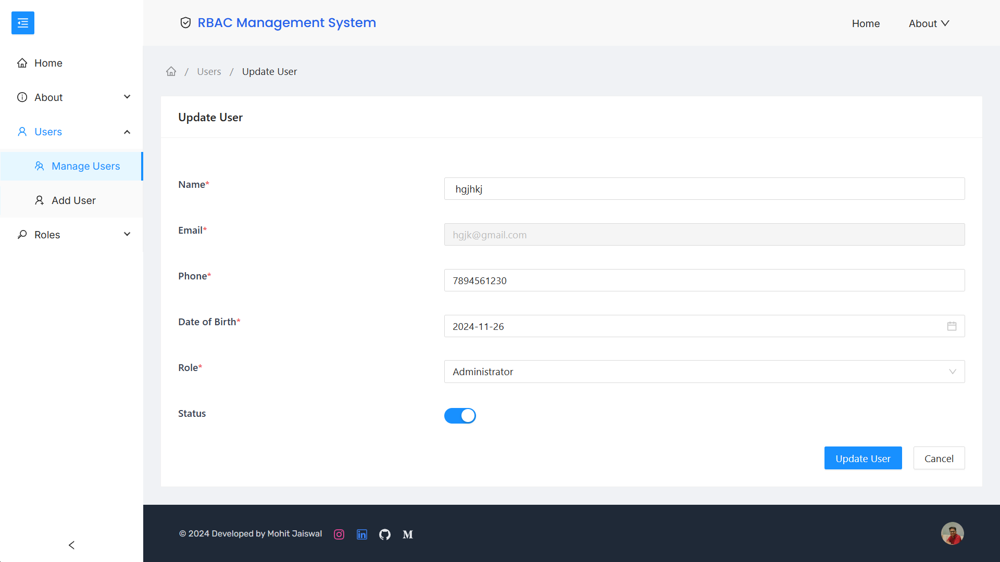
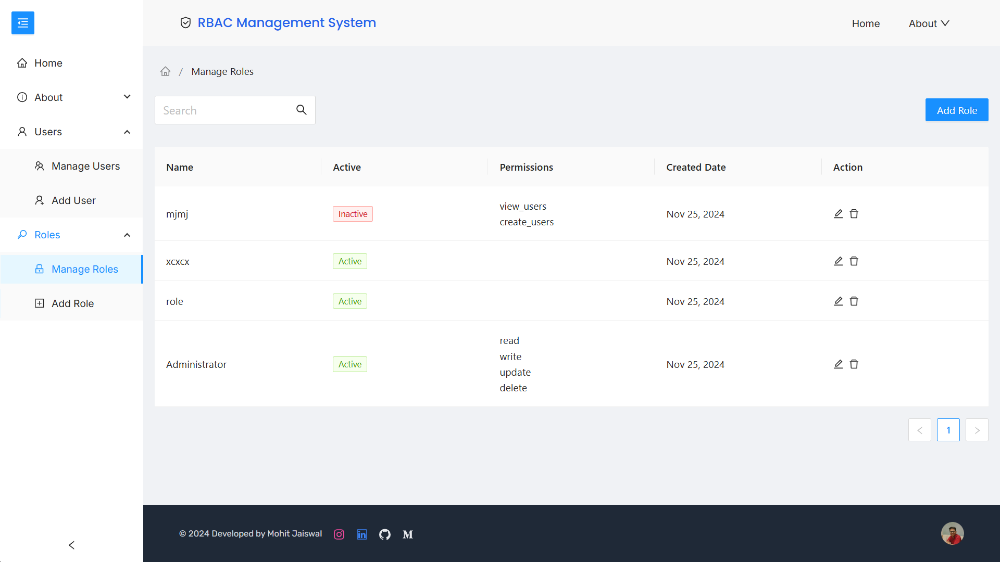
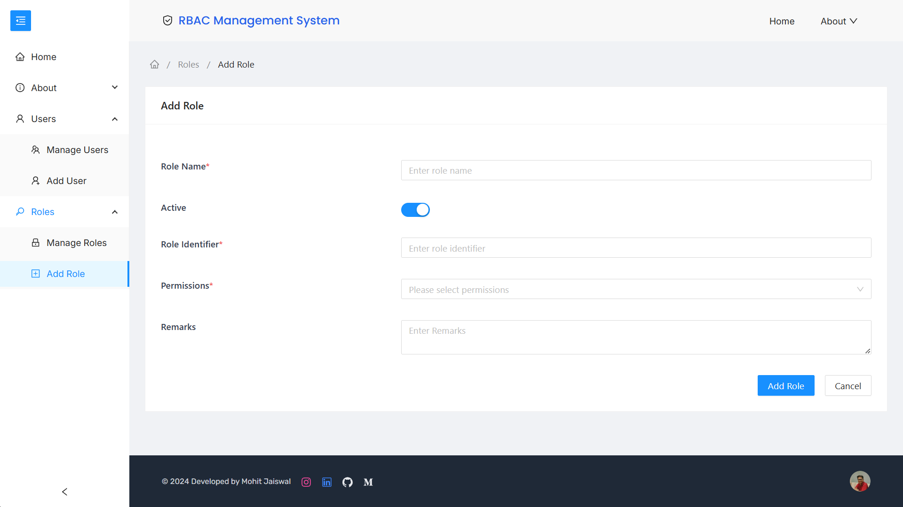

Here are some of the project's best features:

- User Management: View create edit and delete users and manage their roles and permissions.

- Role Management: Create edit and delete roles and assign specific permissions.

- Permission Management: Define and assign granular permissions to users and roles.

- Seamless Navigation: Smooth navigation with Lazy Loading for modules and Route Guards for access control.

- Integrated: Already integrated with a backend system for dynamic user/role management.

- User-Friendly Interface: Modern UI with Ng-Zorro and custom components for a sleek experience.


<h2 style="margin-bottom: 0.5rem">Install and Run ⚙️</h2>

I. Prerequisites:

- Node.js (>= 16.x.x)
- npm (>= 8.x.x)

II. Clone the repository:

```bash
  git clone https://github.com/mohitjaiswal28/rbac-frontend
  cd rbac-management-system
```

III. Install dependencies:

```bash
  npm install
```

IV. Run the development server:

```bash
  npm start
```

V. This will start the application on http://localhost:4200.

<h2 style="margin-bottom: 0.5rem">Project Structure 📁</h2>

```
src/
├── app/
│   ├── core/
│   ├── shared/
│   ├── home/
│   ├── role/
│   │   ├── role.add/
│   │   └── role.manage/
│   ├── user/
│   │   ├── user.add/
│   │   └── user.manage/
│   ├── app-routing.module.ts
│   ├── app.component.ts
│   └── app.module.ts
├── assets/
├── environments/
├── styles/
├── index.html
└── main.ts
```

<h2 style="margin-bottom: 0.5rem">Screenshots ✅</h2>

- Home Page



- About Project



- About Developer



- About Tech Stack Used



- User Functionalities






- Role Functionalities




<h2 style="margin-bottom: 0.5rem">Contact 💡</h2> 
For inquiries, please reach out to:
<br>
Mohit Jaiswal: mohitjaiswal2883@gmail.com ✉️

# RBAC Frontend Application

## Prerequisites

- Node.js and npm installed
- Angular CLI installed (`npm install -g @angular/cli`)
- JSON Server installed (`npm install -g json-server`)

## Setup Instructions

### 1. Install dependencies

```bash
npm install
```

### 2. Running the JSON Server

The application uses JSON Server to simulate a REST API using the data in `db.json`.

**Important**: Make sure to run JSON Server before starting the Angular application:

```bash
# Navigate to the project root directory
cd "c:\Users\ASK EHS\Desktop\Parth\New folder\rbac-frontend"

# Start JSON Server
json-server --watch db.json
```

The JSON Server will start at http://localhost:3000

### 3. Running the Angular application

In a new terminal window:

```bash
# Start the Angular app
ng serve
```

The application will be available at http://localhost:4200

## Default Users

The following users are available for testing:

1. Admin User
   - Email: admin@example.com
   - Password: password123

2. Manager User
   - Email: manager@example.com
   - Password: password123

3. Standard User
   - Email: user@example.com
   - Password: password123

## Troubleshooting

**Connection issues:**
- If you see "Cannot connect to the server" errors, make sure JSON Server is running at http://localhost:3000
- Verify that the db.json file is in the correct location (project root directory)
- Check if port 3000 is not being used by another application
